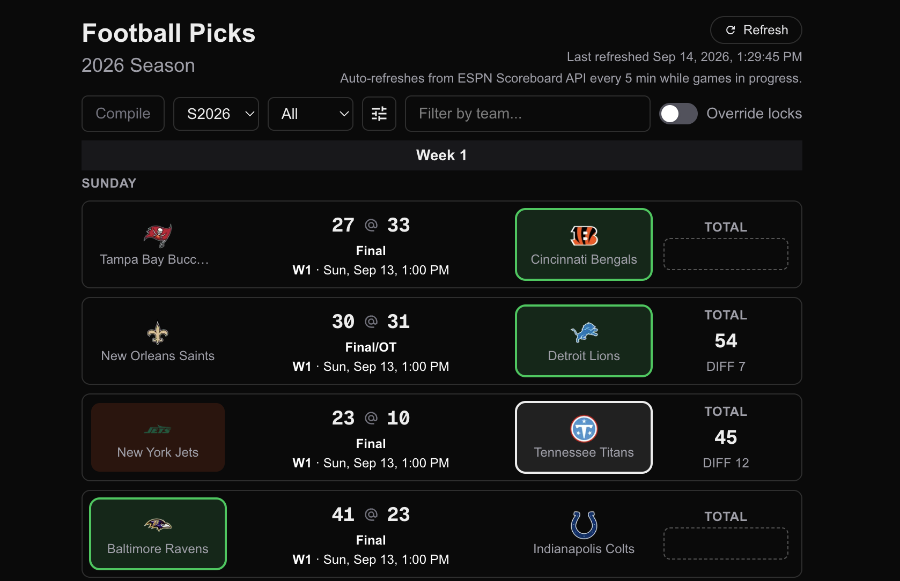
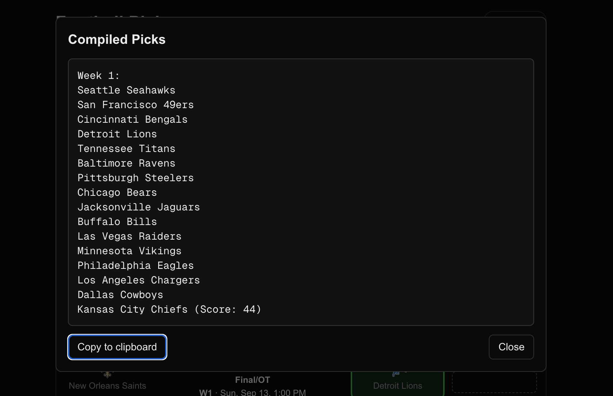

# Football Picks



A personal NFL "pick 'em" tracker: pick the winner of every game each week,
optionally add a tiebreaker score-total guess, and see it all laid out by
season and week. It's a [Next.js](https://nextjs.org) app.

## Features

- **Weekly schedule**, pulled from ESPN's public scoreboard API and cached
  in a local SQLite database (`pnpm seed` loads a season; a background
  refresh loop keeps in-progress weeks current afterward).

- **Pick a winner** for each game, plus an optional score-total tiebreaker
  entry.

- **Picks lock at kickoff**, with a manual override toggle for correcting a
  pick on an in-progress game.

- **Filters** for team, game status (upcoming/in-progress/final), and game
  day, plus bye-week callouts per week.

- **Compile view**: turns a week's picks into a plain-text list, ready to
  copy and paste elsewhere:

  

- **Live refresh status** showing when scores were last synced from ESPN,
  with a manual refresh button.

## Getting Started

This project uses [`just`](https://just.systems) as its command runner. If
you don't already have it, install it (e.g. `brew install just`).
You can also fallback to `pnpm` commands as listed below.

First, bootstrap the dev environment (installs dependencies, pre-commit
hooks, and generates Next's type stubs):

```bash
just bootstrap
# or, without just:
pnpm install
```

Then start the dev server:

```bash
just up
# alias:
just dev

# or, without just:
pnpm dev
```

Open [http://localhost:3001](http://localhost:3001) to see the running site.

### Loading a season

The database starts empty. Seed it with a season's schedule (defaults to
the current year):

```bash
pnpm seed
```

Once the season is seeded, the running server keeps it up to date on its own.
Refreshes occur once every 5 minutes while games are in-progress,
or can be triggered manually in the top-right of the page.

> [!NOTE]
> The ESPN Scoreboard API may only show details of the current season.
>
> This is only tested (so far) on the current 2026 NFL season;
> YMMV next year.

## Why?

For fun. 🙂

I have relatives and friends who run friendly pools to pick winners,
not getting involved in fantasy football.
We pick our winners and tell each other.
This just helps me do that in the geekiest way I know how.

## AI contribution note

I used Claude (Sonnet 5) for much of the development work here.
I don't intend this to be used outside my local,
so not much of a concern for code quality
(though I still nitpick some stuff manually when I see it).

If you spot something sloppy and have a suggestion to improve it,
let me know!
